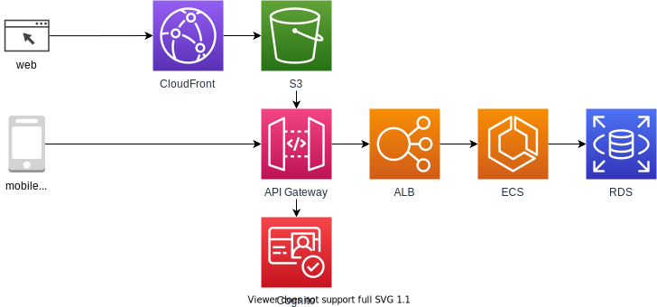

[](https://github.com/psf/black)

# 2or3-pay

## Architecture


## Build
1. Copy .env from .env.template

    ```
    cp .env.template .env
    ```

1. Edit your .env file. Please see Env section for detail.

1. Build docker image by docker-compose

    ``
    docker-compose build
    ``

## Run
- Run a web & db server.

```
$ docker-compose up
```

- Run db migration

```
$ docker-compose run coin-web pipenv run python manage.py migrate
```

## Env
- .env

| name | description |
| - | - |
| DB_PASS | password for database login |

## Add application
- command

```
$ docker-compose run coin-web pupenv run python manage.py startapp [application name]
```

### docker-compose

```

  sample-web:               # [application name]-web
    extends:
      file: parent.yml
      service: web
    volumes:                # mount application volume to /code directory.
      - ./app/coin:/code/coin
    ports:
      - "8099:8000"         # Describe unused port for other application. Container port have to be 8000.
    environment:
      APP_LIST: "payment"   # [application name]. Separated by comma.
    depends_on:
      - db

```

## Test
- Run all test

```
$ docker-compose run coin-web pipenv run python manage.py test
```

- Run application test

```
$ docker-compose run [application name]-web pipenv run python manage.py test [application name]
```

## DB access
- Login Postresql
- Login password is described on .env file.

```
$ docker-compose run db psql -h db -U postgres
```